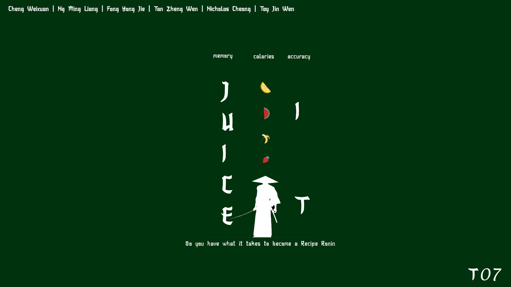
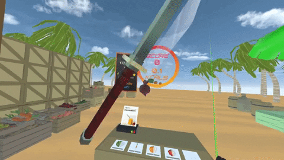
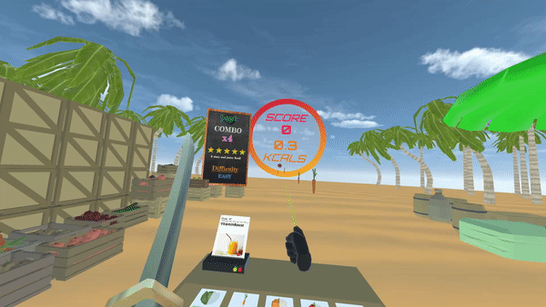
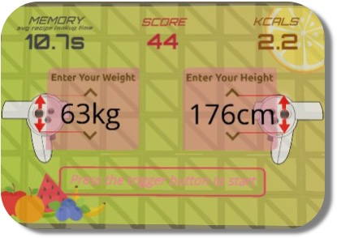

# CS4240_T7_JucieIT

## Project Intro
Juice It is the most action-packed Fruit Juice Joint in town!  

Enhanced by the immersive power of VR, Juice It is a Unity game that 
brings you closer to the ultimate sensory exercise experience of 
running your own Fruit Juice Shop in the metaverse.

## What is the Game About?
For some of us, exercise and fitness comes naturally. But the rest of
us need some coaxing. This game was created for us to "Exercise by
Accident", to help us get a workout at home. 

With Juice It, you can get a surprising amount of exercise "by
accident", when there are many diverse and exciting things
to do to help you get carried away in sweat. 

Juice It is a VR game that blends psychomotor coordination and
cognitive ability to create an immersive fitness experience that is
engaging by transforming your world into the battleground that
is the Fruit Shop.

The game aims to help players simultaneously
get a good workout and practice test their memory. Juice It exercises
both the body and the mind, with a game objective for the player to complete as
many recipes, as quickly and as accurately as possible, as part of our vision for 
players to "Exercise by Accident".

#### Additional Information 
* [NUS 18th STEPs Page](https://uvents.nus.edu.sg/event/20th-steps/module/CS4240/project/7)
* [Youtube Trailer](https://youtu.be/iJCVowHiigQ)

## Setup

#### Platforms
* Oculus
* HTC Vive

#### Requirements
* Unity 2020.2.1f1
* Steam Account
* SteamVR

#### Unity Packages Used
* XR Plugin Management
* Oculus XR Plugin
* OpenXR Plugin
* SteamVR

#### Setup Process
Setup with Repository:
1. Clone repository onto local drive
2. Open project in Unity 2020.2.1f1
3. Download and import all Unity packages used
   1. SteamVR can be downloaded [here](https://assetstore.unity.com/packages/tools/integration/steamvr-plugin-32647)
   2. Other packages can be downloaded from Unity Registry
4. Assign Dpad
   1. Sign in to Steam and download SteamVR (if not already done so)
   2. Go to Window -> SteamVR Input
   3. Click Open binding UI
   4. In the new SteamVR window, edit controller binding
   5. Assign up down left right for directional pad
   6. Save Personal Binding
5. Main game scene is found under Assets/Scenes/mainscene

Alternatively, setup with unity package:
1. Download the latest unity package from Releases
2. Open empty 3D project in Unity 2020.2.1f1
3. Extract package into project
4. Download and import all Unity packages used
   1. SteamVR can be downloaded [here](https://assetstore.unity.com/packages/tools/integration/steamvr-plugin-32647)
   2. Other packages can be downloaded from Unity Registry
5. Assign Dpad
    1. Sign in to Steam and download SteamVR (if not already done so)
    2. Go to Window -> SteamVR Input
    3. Click Open binding UI
    4. In the new SteamVR window, edit controller binding
    5. Assign up down left right for directional pad(Oculus) / trackpad(Vive)
    6. Save Personal Binding
6. Main game scene is found under Assets/Scenes/mainscene

## Game Controls
* Swing Left Hand to slice fruits
* Touch fruits with Right Hand to grab fruits
* Right Trigger to pull fruits toward the player
* Right Grip to control position of fruits
* Adjust weight at start screen
  * Oculus: Left Thumbstick
  * HTC Vive: Left Trackpad
* Adjust height at start screen
  * Oculus: Right Thumbstick
  * HTC Vive: Right Trackpad

## Gameplay
The objective of the game is to complete as many recipes as quickly
and as accurately as possible. 
The in-game score represents the competency and proficiency of the player.
Each recipe failed results in a loss of a star, from a starting of 5 stars.
Aim for the highest score possible!

### Game Mechanics
#### Slice and Dice

* Slice up the fruits you need to complete the recipe

#### Moving Fruits

* Point at the fruit you wish to move
* Hold the Right Grip button and move the fruit around
* Release Right Grip at the location you wish to move the fruit

#### Grabbing Fruits

* Point at the fruit you wish to catch 
* Hold the Right Trigger to suck the fruit towards you
* Touch the fruit with your right hand to catch the fruit 
* Alternatively, you can position your hand in the right place and wait for the fruit to touch your hand

#### Scoring

* Recipes: Complete recipes to increase score
* Combos: consecutive correctly sliced/grabbed fruits rewards bonus points
* Wrong Ingredients: Slicing/Grabbing wrong ingredients deducts points
* Incomplete Recipe: Failed recipes result in the loss of a star
* Memory: The game tracks the amount of time spent looking at the recipe
* Calories: The game tracks the amount of calories lost during gameplay

### Gameplay Guide
1. Starting screen
   1. input your height and weight
2. Start game/tutorial
   1. Press either Grip Buttons to start tutorial
   2. Press either Trigger Buttons to start game
3. Complete recipes on the table
   1. Table shows the current recipe and number of fruits to be sliced or grabbed
   2. Half ingredient icon shows fruits to be cut
   3. Full ingredient icon shows fruits to be grabbed
   4. The number of bars underneath each ingredient shows the number of each ingredient needed for the recipe
4. Scoring
   1. Each recipe completed adds to score
   2. Each recipe failed results in the loss of a star
5. Ending screen
   1. After the loss of all 5 stars, the game over
   2. End game screen shows the final score, memory time and calories burnt
   3. Press either Trigger Buttons to restart the game
